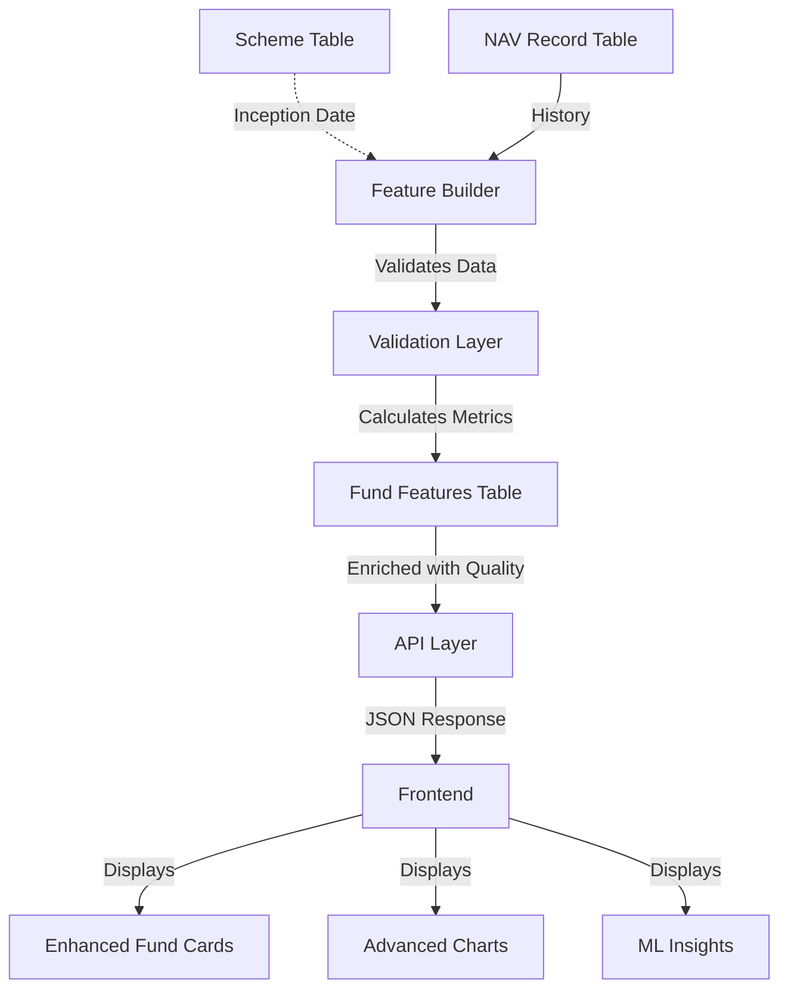
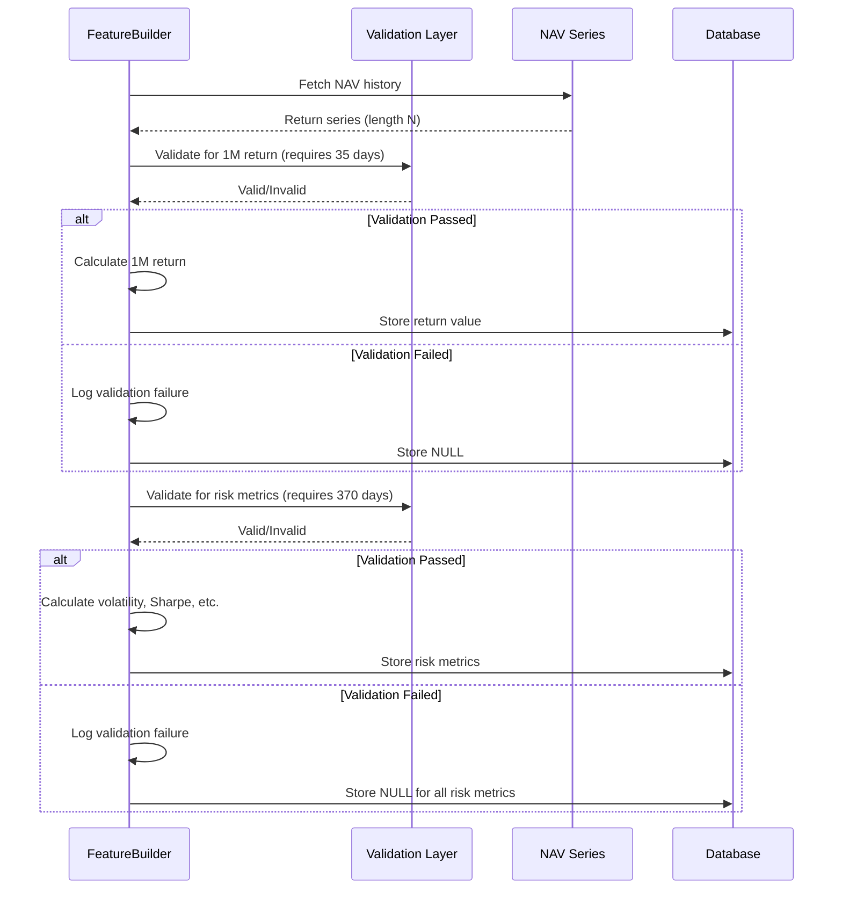

# Design Document: Data Accuracy and Frontend Rebuild

## Overview

This design addresses critical data accuracy issues in MFScope's feature calculation system and rebuilds the frontend with professional-grade visualizations and insights. The core problem is that the system currently calculates trailing returns and risk metrics from insufficient historical data, producing misleading results. For example, a fund with only 1 year of NAV data incorrectly generates a 5-year return figure.

The solution implements strict data validation in the feature builder to ensure metrics are only calculated when sufficient historical data exists. The frontend is enhanced with comprehensive data quality indicators, advanced visualizations, ML insights showcase, and proper handling of unavailable metrics.

### Key Design Goals

1. **Data Integrity**: Never display metrics calculated from insufficient data
2. **Transparency**: Clearly indicate when data is unavailable and why
3. **Professional UX**: Showcase ML/AI capabilities through rich visualizations
4. **Backward Compatibility**: Maintain existing API contracts while adding new fields
5. **Performance**: Minimize impact on feature calculation performance

## Architecture

### System Components



### Data Flow


1. **NAV History Collection**: Existing NAV ingestion continues unchanged
2. **Validation Pre-Check**: Before calculating any metric, validate NAV history length meets minimum threshold
3. **Metric Calculation**: Calculate metric only if validation passes; return `None` otherwise
4. **Database Storage**: Store calculated metrics with explicit `NULL` for unavailable metrics
5. **API Enrichment**: Add `data_quality` object to API responses indicating which metrics are valid
6. **Frontend Rendering**: Display metrics with appropriate data quality indicators and "N/A" handling

## Components and Interfaces

### Backend Validation Layer

#### FeatureBuilder Validation Functions

**Location**: `backend/features/feature_builder.py`

Add validation functions before metric calculations:

```python
# Minimum required days for each metric type (includes buffer for holidays)
MIN_DAYS_1M = 35
MIN_DAYS_3M = 95
MIN_DAYS_6M = 185
MIN_DAYS_1Y = 370
MIN_DAYS_3Y = 1100
MIN_DAYS_5Y = 1850

def _validate_nav_length(series: pd.Series, required_days: int) -> bool:
    """Check if NAV series has enough data points for calculation."""
    return len(series) >= required_days

def _trailing_return_validated(series: pd.Series, days: int, min_required: int) -> float | None:
    """Calculate trailing return only if sufficient data exists."""
    if not _validate_nav_length(series, min_required):
        logger.debug(f"Insufficient data for {days}d return: {len(series)} < {min_required}")
        return None
    # existing calculation logic...
```


#### Validation Integration

Modify the `build_features` method to validate before calculating:

```python
# Returns - with validation
r1m = _trailing_return_validated(nav_series, 30, MIN_DAYS_1M)
r3m = _trailing_return_validated(nav_series, 90, MIN_DAYS_3M)
r6m = _trailing_return_validated(nav_series, 180, MIN_DAYS_6M)
r1y = _trailing_return_validated(nav_series, 365, MIN_DAYS_1Y)
r3y = _trailing_return_validated(nav_series, 365 * 3, MIN_DAYS_3Y)
r5y = _trailing_return_validated(nav_series, 365 * 5, MIN_DAYS_5Y)

# Risk metrics - validate 1-year data requirement
if _validate_nav_length(nav_1y, MIN_DAYS_1Y):
    vol = _volatility(rets_1y)
    sharpe = _sharpe(rets_1y)
    sortino = _sortino(rets_1y)
    mdd = _max_drawdown(nav_1y)
    alpha, beta = _alpha_beta(rets_1y, bench_rets) if benchmark_series else (None, None)
else:
    logger.debug(f"Insufficient data for risk metrics: scheme_id={scheme_id}")
    vol = sharpe = sortino = mdd = alpha = beta = None
```

### Database Schema Changes

#### Scheme Model Addition

**Location**: `backend/db/models.py`

Add `inception_date` field to the `Scheme` model:

```python
class Scheme(Base):
    __tablename__ = "scheme"
    
    # ... existing fields ...
    
    inception_date: Mapped[date | None] = mapped_column(Date, index=True)
    
    # ... rest of model ...
```

**Migration Strategy**:
1. Add nullable `inception_date` column
2. Populate from earliest NAV date for each scheme
3. Update AMFI ingestion to capture inception date if available
4. Keep nullable to handle missing data gracefully


### API Schema Updates

#### Enhanced Response Schemas

**Location**: `backend/api/schemas.py`

Add new `DataQuality` schema:

```python
class DataQuality(BaseModel):
    """Indicates which metrics are calculated from sufficient data."""
    nav_days_available: int
    returns_valid: bool
    risk_metrics_valid: bool
    inception_date: date | None
    
class FundCardOut(BaseModel):
    # ... existing fields ...
    data_quality: DataQuality | None = None
    
class FundFeaturesOut(OrmBase):
    # ... existing fields ...
    data_quality: DataQuality | None = None
```

#### API Layer Data Quality Calculation

**Location**: `backend/api/main.py`

Compute data quality indicators when building responses:

```python
def _compute_data_quality(scheme_id: int, scheme: Scheme, nav_count: int) -> DataQuality:
    """Compute data quality indicators for a scheme."""
    returns_valid = nav_count >= MIN_DAYS_1Y
    risk_valid = nav_count >= MIN_DAYS_1Y
    
    return DataQuality(
        nav_days_available=nav_count,
        returns_valid=returns_valid,
        risk_metrics_valid=risk_valid,
        inception_date=scheme.inception_date,
    )
```

Integrate into fund list and detail endpoints to include data quality in responses.

### Frontend Component Architecture

#### Enhanced FundCard Component

**Location**: `frontend/src/components/FundCard.tsx`


**Key Enhancements**:

1. **Sharpe Ratio Display**: Add prominent Sharpe ratio metric with tooltip
2. **Category Comparison**: Show fund return vs category average with visual indicator
3. **Larger Performance Charts**: Increase sparkline size and add trend indicators
4. **Data Quality Badges**: Show indicators when metrics are from insufficient data
5. **Risk Gauge**: Integrate visual risk level display

**Component Structure**:

```tsx
interface FundCardProps {
  fund: FundCardType;
  categoryAverage?: number;
}

export default function FundCard({ fund, categoryAverage }: FundCardProps) {
  const hasInsufficientData = !fund.data_quality?.returns_valid;
  
  return (
    <article className="fund-card">
      {/* Header with scores and badges */}
      <div className="card-header">
        <ScoreBadge conviction={fund.conviction} />
        <RiskGauge level={fund.risk_level} score={fund.risk_score} />
        {hasInsufficientData && <InsufficientDataBadge />}
      </div>
      
      {/* Metrics grid with Sharpe ratio */}
      <MetricsGrid>
        <Metric label="1Y" value={fund.return_1y} />
        <Metric label="3Y" value={fund.return_3y} />
        <Metric label="Sharpe" value={fund.sharpe_ratio} highlighted />
      </MetricsGrid>
      
      {/* Enhanced sparkline with trend */}
      <PerformanceChart data={fund.nav_sparkline} size="large" />
      
      {/* Category comparison */}
      {categoryAverage && (
        <CategoryComparison fundReturn={fund.return_1y} categoryAvg={categoryAverage} />
      )}
    </article>
  );
}
```


#### New Visualization Components

##### RiskGauge Component

**Location**: `frontend/src/components/RiskGauge.tsx`

Visual gauge showing risk level with color-coded indicators:

```tsx
interface RiskGaugeProps {
  level: string | null;
  score: number | null;
  size?: 'sm' | 'md' | 'lg';
}

export default function RiskGauge({ level, score, size = 'md' }: RiskGaugeProps) {
  // Radial gauge visualization
  // Color-coded (green=Low, yellow=Medium, red=High)
  // Shows numeric score on hover
  // Falls back to "N/A" if data unavailable
}
```

##### PerformanceChart Component

**Location**: `frontend/src/components/PerformanceChart.tsx`

Enhanced chart with multiple timeframes and overlays:

```tsx
interface PerformanceChartProps {
  navHistory: NAVPoint[];
  timeframe?: '1M' | '3M' | '6M' | '1Y' | '3Y' | '5Y';
  benchmark?: NAVPoint[];
  movingAverages?: { ma50?: number[]; ma200?: number[] };
  showTrend?: boolean;
}

export default function PerformanceChart(props: PerformanceChartProps) {
  // Recharts line chart with larger dimensions
  // Timeframe selector buttons
  // Benchmark overlay (optional)
  // Moving average overlays
  // Trend indicators (arrows, colors)
  // Tooltip with precise values and percentage changes
}
```


##### PeerComparisonChart Component

**Location**: `frontend/src/components/PeerComparisonChart.tsx`

Scatter plot showing risk-return profile vs category peers:

```tsx
interface PeerComparisonChartProps {
  fund: { return1y: number; risk: number; name: string };
  peers: Array<{ return1y: number; risk: number; name: string }>;
  categoryAverage: { return1y: number; risk: number };
}

export default function PeerComparisonChart(props: PeerComparisonChartProps) {
  // Recharts scatter plot
  // X-axis: Risk (volatility or beta)
  // Y-axis: Return (1Y trailing)
  // Highlight target fund with distinct color/size
  // Show category average as reference line or point
  // Quadrant lines to indicate risk/return zones
}
```

##### MLInsightsPanel Component

**Location**: `frontend/src/components/MLInsightsPanel.tsx`

Showcases ML-driven score breakdown and SHAP values:

```tsx
interface MLInsightsPanelProps {
  score: FundScore;
  componentScores: {
    returns: number;
    consistency: number;
    cost: number;
    sentiment: number;
    stability: number;
  };
  shapValues?: Record<string, number>;
}

export default function MLInsightsPanel(props: MLInsightsPanelProps) {
  // Composite score breakdown (stacked bar or radial)
  // Component scores with labels
  // SHAP values in plain language
  // Risk assessment explanation
  // Sentiment impact visualization
}
```


##### InsufficientDataTooltip Component

**Location**: `frontend/src/components/InsufficientDataTooltip.tsx`

Reusable component for displaying "N/A" with explanation:

```tsx
interface InsufficientDataTooltipProps {
  metric: string;
  requiredDays: number;
  availableDays: number;
  inceptionDate?: Date;
}

export default function InsufficientDataTooltip(props: InsufficientDataTooltipProps) {
  // Displays "N/A" with tooltip
  // Tooltip explains: "{metric} requires {requiredDays} days of data"
  // Shows: "Fund has {availableDays} days available"
  // If inception date available: "Fund launched on {inceptionDate}"
  // Consistent styling across all uses
}
```

#### State Management for Filters

**Location**: `frontend/src/pages/HomePage.tsx`

Add new filter states:

```tsx
const [riskFilter, setRiskFilter] = useState<string | null>(null);
const [performanceFilter, setPerformanceFilter] = useState<'all' | 'outperformers' | 'underperformers'>('all');
const [managerTenure, setManagerTenure] = useState<string | null>(null);
const [aumBucket, setAumBucket] = useState<string | null>(null);

// Apply filters in useMemo query construction
const query = useMemo(() => ({
  // ... existing filters ...
  risk_level: riskFilter ?? undefined,
  performance: performanceFilter !== 'all' ? performanceFilter : undefined,
  manager_tenure_min: managerTenure ? parseFloat(managerTenure) : undefined,
  aum_bucket: aumBucket ?? undefined,
}), [/* dependencies */]);
```


## Data Models

### Extended Scheme Model

```python
class Scheme(Base):
    __tablename__ = "scheme"
    
    id: Mapped[int] = mapped_column(Integer, primary_key=True)
    scheme_code: Mapped[str] = mapped_column(String(20), unique=True, nullable=False)
    scheme_name: Mapped[str] = mapped_column(String(512), nullable=False)
    amc_name: Mapped[str] = mapped_column(String(256), nullable=False)
    category: Mapped[str] = mapped_column(String(64), nullable=False)
    
    # NEW FIELD
    inception_date: Mapped[date | None] = mapped_column(Date, index=True)
    
    # ... rest of existing fields ...
```

### DataQuality Schema

```python
class DataQuality(BaseModel):
    """Data quality indicators for calculated metrics."""
    nav_days_available: int  # Number of days of NAV history
    returns_valid: bool      # True if sufficient data for returns
    risk_metrics_valid: bool # True if sufficient data for risk metrics
    inception_date: date | None  # Fund launch date
```

### Enhanced API Response Models

```python
class FundCardOut(BaseModel):
    id: int
    scheme_code: str
    scheme_name: str
    amc_name: str
    category: str
    
    # Scores
    composite_score: float | None
    conviction: str | None
    risk_score: float | None
    risk_level: str | None
    
    # Metrics
    return_1y: float | None
    return_3y: float | None
    sharpe_ratio: float | None  # NEW
    expense_ratio: float | None
    aum_crore: float | None
    
    # Visualization data
    nav_sparkline: list[NAVPoint]
    
    # NEW: Data quality
    data_quality: DataQuality | None
```


```python
class FundFeaturesOut(OrmBase):
    feature_date: date
    
    # Returns
    return_1m: float | None
    return_3m: float | None
    return_6m: float | None
    return_1y: float | None
    return_3y: float | None
    return_5y: float | None
    
    # Risk metrics
    volatility_1y: float | None
    sharpe_1y: float | None
    sortino_1y: float | None
    alpha_1y: float | None
    beta_1y: float | None
    max_drawdown_1y: float | None
    
    # Sentiment
    sentiment_7d: float | None
    sentiment_30d: float | None
    news_volume_7d: float | None
    
    # NEW: Data quality
    data_quality: DataQuality | None
```

## Validation Logic Flow

### Feature Calculation Sequence




### Validation Rules

| Metric | Required Days | Buffer Reason |
|--------|---------------|---------------|
| 1-month return | 35 | Accounts for ~5 weekend/holiday days |
| 3-month return | 95 | Accounts for ~5 weekend/holiday days |
| 6-month return | 185 | Accounts for ~5 weekend/holiday days |
| 1-year return | 370 | Accounts for ~5 weekend/holiday days |
| 3-year return | 1100 | Accounts for ~5 days per month |
| 5-year return | 1850 | Accounts for ~5 days per month |
| Volatility (1Y) | 370 | Requires full year for statistical reliability |
| Sharpe (1Y) | 370 | Requires full year for statistical reliability |
| Sortino (1Y) | 370 | Requires full year for statistical reliability |
| Alpha/Beta (1Y) | 370 | Requires full year for statistical reliability |
| Max Drawdown (1Y) | 370 | Requires full year for statistical reliability |

### Validation Implementation Details

**Buffer Days Rationale**:
- Indian equity markets are closed on weekends and national holidays
- Approximately 250 trading days per year (not 365)
- Buffer ensures calculation uses actual trading days, not calendar days
- Conservative approach: prefer showing "N/A" over inaccurate metrics

**Logging Strategy**:
```python
def _trailing_return_validated(series: pd.Series, days: int, min_required: int, 
                                scheme_id: int, metric_name: str) -> float | None:
    if not _validate_nav_length(series, min_required):
        logger.debug(
            f"Validation failed: scheme_id={scheme_id}, "
            f"metric={metric_name}, available={len(series)}, required={min_required}"
        )
        return None
    # Calculate...
```


## Error Handling and Logging

### Validation Failure Logging

**Log Level**: DEBUG (not WARNING) to avoid noise for expected behavior

**Log Structure**:
```python
logger.debug(
    "Validation check",
    extra={
        "scheme_id": scheme_id,
        "scheme_code": scheme_code,
        "metric": metric_name,
        "available_days": len(series),
        "required_days": min_required,
        "validation_result": "failed"
    }
)
```

### Aggregated Statistics

Add admin endpoint to expose validation statistics:

**Endpoint**: `GET /api/v1/admin/validation-stats`

**Response**:
```json
{
  "last_feature_run": "2024-01-15T10:30:00Z",
  "total_schemes_processed": 5420,
  "validation_failures": {
    "return_1m": 120,
    "return_3m": 145,
    "return_6m": 180,
    "return_1y": 320,
    "return_3y": 1200,
    "return_5y": 2100,
    "risk_metrics": 340
  },
  "validation_failure_rate": 0.35
}
```

### Error Handling in Frontend

**Pattern**: Graceful degradation with clear user communication


```tsx
function MetricDisplay({ value, label, dataQuality }: MetricDisplayProps) {
  if (value === null || value === undefined) {
    return (
      <InsufficientDataTooltip 
        metric={label}
        requiredDays={getRequiredDays(label)}
        availableDays={dataQuality?.nav_days_available ?? 0}
        inceptionDate={dataQuality?.inception_date}
      >
        <span className="text-muted">N/A</span>
      </InsufficientDataTooltip>
    );
  }
  
  return <span className="font-bold">{formatValue(value)}</span>;
}
```

### API Error Responses

Maintain backward compatibility while adding validation errors:

```json
{
  "status": "partial_success",
  "message": "Features calculated with some validation failures",
  "data": {
    "scheme_id": 123,
    "return_1y": 12.5,
    "return_5y": null,
    "data_quality": {
      "nav_days_available": 400,
      "returns_valid": true,
      "risk_metrics_valid": true,
      "inception_date": "2022-06-15"
    }
  },
  "warnings": [
    "5-year return unavailable: insufficient history (400 < 1850 days)"
  ]
}
```

## Correctness Properties

*A property is a characteristic or behavior that should hold true across all valid executions of a system-essentially, a formal statement about what the system should do. Properties serve as the bridge between human-readable specifications and machine-verifiable correctness guarantees.*

### Prework: Analyzing Acceptance Criteria for Testability

Let me analyze each acceptance criterion to determine if it's testable as a property, example, edge case, or not testable:


### Property Reflection

After analyzing all acceptance criteria, several properties can be consolidated:

**Consolidation Opportunities**:
1. Requirements 1.1-1.6 (return validation) can be combined into a single property about return validation thresholds
2. Requirements 2.1-2.6 (risk metric validation) can be combined into a single property about risk metric validation
3. Requirements 4.2-4.4 (data_quality object correctness) can be combined into one property
4. Requirements 10.1-10.2 (N/A display) can be combined into one property about null metric handling

**Retained Distinct Properties**:
- API data_quality object presence (4.1)
- Frontend null handling with tooltips (10.1, 10.2, 10.5 combined)
- Sorting behavior with nulls (7.5)
- Filtering behavior (7.1-7.4 can be combined)
- API backward compatibility (15.1-15.3 combined)
- Logging validation failures (14.1-14.2 combined)

### Property 1: Return Validation Threshold Compliance

*For any* NAV series and return period (1M, 3M, 6M, 1Y, 3Y, 5Y), IF the NAV series length is less than the required threshold for that period (35, 95, 185, 370, 1100, 1850 days respectively), THEN the Feature_Builder SHALL return NULL for that return metric.

**Validates: Requirements 1.1, 1.2, 1.3, 1.4, 1.5, 1.6**

### Property 2: Risk Metric Validation Threshold Compliance

*For any* NAV series, IF the NAV series length is less than 370 days, THEN the Feature_Builder SHALL return NULL for all risk metrics (volatility, Sharpe ratio, Sortino ratio, alpha, beta, maximum drawdown).

**Validates: Requirements 2.1, 2.2, 2.3, 2.4, 2.5, 2.6**


### Property 3: Data Quality Object Correctness

*For any* fund with calculated features, the API response SHALL include a data_quality object where `returns_valid` is true IF AND ONLY IF NAV history >= 370 days, `risk_metrics_valid` is true IF AND ONLY IF NAV history >= 370 days, and `nav_days_available` equals the actual count of NAV records for that fund.

**Validates: Requirements 4.1, 4.2, 4.3, 4.4**

### Property 4: Frontend Null Metric Display

*For any* metric with a NULL value in the API response, the Frontend SHALL display "N/A" text with a tooltip that includes the inception date (if available) and the required data period for that metric.

**Validates: Requirements 3.3, 5.2, 10.1, 10.2, 10.5, 12.5**

### Property 5: Null-Safe Sorting

*For any* sorting operation on any metric column, funds with NULL values for that metric SHALL appear last in the sort order (whether ascending or descending).

**Validates: Requirements 7.5**

### Property 6: Filter Correctness

*For any* applied filter (risk level, performance, manager tenure, AUM bucket), the resulting fund list SHALL contain only funds that match the filter criteria, with no false positives or false negatives.

**Validates: Requirements 7.1, 7.2, 7.3, 7.4**

### Property 7: API Backward Compatibility

*For any* API endpoint that existed before these changes, the response SHALL include all previously existing fields with their original types, and new fields (data_quality, inception_date) SHALL be added without removing or renaming existing fields. When a metric is NULL, it SHALL be explicitly represented as `null` in JSON, not omitted.

**Validates: Requirements 15.1, 15.2, 15.3, 15.4**


### Property 8: Validation Failure Logging

*For any* validation failure during feature calculation (return or risk metric), the Feature_Builder SHALL log an entry containing the scheme_code, metric name, available days, and required days.

**Validates: Requirements 14.1, 14.2**

### Property 9: Validation Statistics Aggregation

*For any* feature calculation run, the system SHALL correctly aggregate validation failure counts by metric type, such that the sum of failures per metric equals the count of schemes that failed validation for that metric.

**Validates: Requirements 14.3**

### Property 10: Benchmark Overlay Conditional Rendering

*For any* performance chart, IF benchmark data is provided, THEN the chart SHALL display a benchmark overlay; IF benchmark data is not provided, THEN the chart SHALL not display a benchmark overlay.

**Validates: Requirements 11.4**

### Property 11: Category Performance Highlighting

*For any* fund where both fund return and category average return are available, IF fund return > category average, THEN the UI SHALL display a positive performance indicator; IF fund return < category average, THEN the UI SHALL display a negative performance indicator.

**Validates: Requirements 9.4**

### Property 12: Sparkline Insufficient Data Handling

*For any* fund card, IF the nav_sparkline data has fewer than 10 points or is empty, THEN the Frontend SHALL display a message indicating insufficient history instead of attempting to render the sparkline.

**Validates: Requirements 10.3**


## Testing Strategy

This feature requires a dual testing approach combining property-based testing for validation logic and example-based testing for UI components.

### Property-Based Testing (PBT)

**Applicable Areas**:
- Backend validation logic (FeatureBuilder validation functions)
- Data quality calculation
- API response correctness
- Frontend filtering and sorting logic

**PBT Library**: `hypothesis` (Python) for backend, `fast-check` (TypeScript) for frontend

**Minimum Iterations**: 100 per property test

**Property Tests to Implement**:

1. **Backend Validation Tests** (`test_feature_builder_validation.py`):
   - Property 1: Return validation thresholds
     - **Feature: data-accuracy-and-frontend-rebuild, Property 1**: For any NAV series and return period, validate that NULL is returned when insufficient data
   - Property 2: Risk metric validation thresholds
     - **Feature: data-accuracy-and-frontend-rebuild, Property 2**: For any NAV series < 370 days, all risk metrics return NULL
   
2. **API Data Quality Tests** (`test_api_data_quality.py`):
   - Property 3: Data quality object correctness
     - **Feature: data-accuracy-and-frontend-rebuild, Property 3**: For any fund, data_quality flags match actual NAV history length
   - Property 7: API backward compatibility
     - **Feature: data-accuracy-and-frontend-rebuild, Property 7**: All existing fields present, new fields added, nulls explicit

3. **Logging Tests** (`test_validation_logging.py`):
   - Property 8: Validation failure logging
     - **Feature: data-accuracy-and-frontend-rebuild, Property 8**: For any validation failure, log contains scheme_code and required days
   - Property 9: Statistics aggregation
     - **Feature: data-accuracy-and-frontend-rebuild, Property 9**: Aggregated failure counts match actual failures


4. **Frontend Logic Tests** (`test_filtering_sorting.test.ts`):
   - Property 5: Null-safe sorting
     - **Feature: data-accuracy-and-frontend-rebuild, Property 5**: For any metric sort, nulls appear last
   - Property 6: Filter correctness
     - **Feature: data-accuracy-and-frontend-rebuild, Property 6**: For any filter, results match filter criteria exactly
   
5. **Frontend Rendering Tests** (`test_metric_display.test.ts`):
   - Property 4: Null metric display
     - **Feature: data-accuracy-and-frontend-rebuild, Property 4**: For any null metric, "N/A" with tooltip appears
   - Property 10: Benchmark overlay
     - **Feature: data-accuracy-and-frontend-rebuild, Property 10**: Benchmark overlay presence matches data availability
   - Property 11: Performance highlighting
     - **Feature: data-accuracy-and-frontend-rebuild, Property 11**: Highlighting matches fund vs category performance
   - Property 12: Sparkline insufficient data
     - **Feature: data-accuracy-and-frontend-rebuild, Property 12**: Short sparkline data shows message instead of rendering

### Example-Based Unit Tests

**Applicable Areas**:
- UI component rendering
- Schema validation
- Specific edge cases

**Unit Tests to Implement**:

1. **Backend Schema Tests**:
   - Test inception_date field exists on Scheme model (Req 3.1)
   - Test data quality schema structure
   - Test backward compatible response structure

2. **Frontend Component Tests**:
   - Test FundCard displays composite score (Req 5.1)
   - Test RiskBadge displays correct risk level (Req 5.4)
   - Test PerformanceChart renders with timeframe options (Req 6.1)
   - Test PeerComparisonChart renders scatter plot (Req 6.2)
   - Test MLInsightsPanel renders score breakdown (Req 8.1)
   - Test InsufficientDataTooltip shows required information (Req 10.1)


3. **Admin Endpoint Tests**:
   - Test validation statistics endpoint exists (Req 14.4)
   - Test validation warning threshold logging (Req 14.5)

### Integration Tests

**Applicable Areas**:
- Data refresh workflow
- End-to-end API responses
- Database migration

**Integration Tests to Implement**:

1. **Refresh Workflow Tests**:
   - Test refresh recalculates features with validation (Req 13.1)
   - Test cache invalidation after refresh (Req 13.2)
   - Test API returns updated metrics (Req 13.3)

2. **End-to-End Tests**:
   - Test full fund list page with filters
   - Test fund detail page with all visualizations
   - Test admin statistics endpoint

### Test Data Strategy

**NAV Series Generation** (for property tests):
```python
from hypothesis import given, strategies as st

@given(st.integers(min_value=0, max_value=2000))
def test_return_validation(nav_days: int):
    """Generate NAV series of varying lengths."""
    nav_series = generate_nav_series(nav_days)
    result = _trailing_return_validated(nav_series, 365, 370)
    
    if nav_days < 370:
        assert result is None
    else:
        assert result is not None
```

**Fund Data Generation** (for frontend tests):
```typescript
import fc from 'fast-check';

fc.assert(
  fc.property(
    fc.record({
      return_1y: fc.option(fc.float(), { nil: null }),
      data_quality: fc.record({
        returns_valid: fc.boolean(),
        nav_days_available: fc.integer({ min: 0, max: 2000 })
      })
    }),
    (fund) => {
      const rendered = render(<FundCard fund={fund} />);
      // Assert N/A appears when return_1y is null
    }
  )
);
```


### Test Coverage Goals

- **Backend validation logic**: 100% coverage of validation functions
- **API data quality calculation**: 100% coverage of data quality computation
- **Frontend metric display**: 90%+ coverage of null handling logic
- **Filtering/sorting logic**: 100% coverage of filter and sort functions

### Performance Testing

**Validation Impact Assessment**:
- Measure feature calculation time before/after validation changes
- Ensure validation checks add < 5% overhead
- Test with datasets of 1,000, 5,000, and 10,000 schemes

**Frontend Performance**:
- Test rendering performance with large fund lists (1000+ items)
- Measure chart rendering time for various data sizes
- Ensure filter/sort operations complete in < 100ms

## Implementation Sequence

### Phase 1: Backend Validation (Priority: Critical)

1. Add validation constants to `feature_builder.py`
2. Implement `_validate_nav_length()` helper
3. Update `_trailing_return()` to accept validation parameters
4. Modify `build_features()` to validate before calculating
5. Add validation logging
6. Write property-based tests for validation logic
7. Run full feature rebuild to generate validated data

**Estimated Effort**: 2-3 days

### Phase 2: Database Schema Update (Priority: High)

1. Create Alembic migration for `inception_date` field
2. Write data migration script to populate from earliest NAV
3. Test migration on staging database
4. Deploy migration to production
5. Update Scheme model in `models.py`

**Estimated Effort**: 1 day


### Phase 3: API Schema Enhancement (Priority: High)

1. Add `DataQuality` schema to `schemas.py`
2. Update `FundCardOut` and `FundFeaturesOut` schemas
3. Implement `_compute_data_quality()` helper in `main.py`
4. Integrate data quality into `/api/v1/funds` endpoint
5. Integrate data quality into `/api/v1/funds/{scheme_code}` endpoint
6. Add `sharpe_ratio` to `FundCardOut`
7. Write API integration tests
8. Test backward compatibility with existing clients

**Estimated Effort**: 2 days

### Phase 4: Frontend Foundation Components (Priority: High)

1. Create `InsufficientDataTooltip` component
2. Create `RiskGauge` component
3. Update `RiskBadge` with enhanced styling
4. Create utility functions for data quality checks
5. Write component unit tests

**Estimated Effort**: 2 days

### Phase 5: Enhanced FundCard (Priority: High)

1. Update `FundCard.tsx` to display Sharpe ratio
2. Add data quality indicators
3. Integrate `InsufficientDataTooltip` for null metrics
4. Add category comparison display
5. Enhance sparkline size and styling
6. Write property-based tests for null handling
7. Write snapshot tests for various states

**Estimated Effort**: 2-3 days


### Phase 6: Advanced Visualizations (Priority: Medium)

1. Create `PerformanceChart` component with timeframe selector
2. Implement benchmark overlay functionality
3. Create `PeerComparisonChart` scatter plot component
4. Create `MLInsightsPanel` component
5. Add moving average overlays
6. Write component tests

**Estimated Effort**: 3-4 days

### Phase 7: Enhanced Filtering (Priority: Medium)

1. Add risk level filter UI and state
2. Add performance filter UI and state
3. Add manager tenure filter UI and state
4. Add AUM bucket filter UI and state
5. Update API query parameters
6. Update backend endpoints to support new filters
7. Write property-based tests for filter logic
8. Test null-safe sorting

**Estimated Effort**: 2-3 days

### Phase 8: Fund Detail Page Enhancement (Priority: Medium)

1. Integrate `PerformanceChart` into detail page
2. Add `PeerComparisonChart` section
3. Add `MLInsightsPanel` section
4. Add category peer comparison section
5. Add inception date display
6. Write integration tests

**Estimated Effort**: 2-3 days

### Phase 9: Admin Features (Priority: Low)

1. Create `/api/v1/admin/validation-stats` endpoint
2. Add validation statistics aggregation logic
3. Add warning threshold logging
4. Create admin dashboard page (optional)
5. Write tests

**Estimated Effort**: 1-2 days


### Phase 10: Testing and Polish (Priority: High)

1. Run full property-based test suite
2. Run integration tests
3. Perform manual QA on all new features
4. Performance testing and optimization
5. Accessibility testing
6. Cross-browser testing
7. Documentation updates

**Estimated Effort**: 2-3 days

**Total Estimated Effort**: 20-27 days

## Risk Assessment

### Technical Risks

1. **Performance Degradation**:
   - **Risk**: Validation checks could slow feature calculation
   - **Mitigation**: Profile code, optimize validation logic, use vectorized operations
   - **Severity**: Low (validation is simple length check)

2. **Data Migration Issues**:
   - **Risk**: Inception date population could fail for some schemes
   - **Mitigation**: Comprehensive migration testing, rollback plan, handle null gracefully
   - **Severity**: Low

3. **Breaking API Changes**:
   - **Risk**: Existing clients might break if API changes are not backward compatible
   - **Mitigation**: Extensive backward compatibility testing, version API if needed
   - **Severity**: Medium

4. **Frontend Performance with Large Datasets**:
   - **Risk**: Rendering 1000+ fund cards with enhanced visualizations could be slow
   - **Mitigation**: Virtual scrolling, lazy loading, pagination, optimize renders
   - **Severity**: Medium

### Business Risks

1. **User Confusion from N/A Metrics**:
   - **Risk**: Users might be confused by increased "N/A" displays
   - **Mitigation**: Clear tooltips, educational content, inception date context
   - **Severity**: Low

2. **Reduced Fund Coverage**:
   - **Risk**: Fewer funds will show 5-year returns (by design)
   - **Mitigation**: This is correct behavior; communicate data quality improvements
   - **Severity**: Low


## Deployment Strategy

### Pre-Deployment

1. **Staging Environment Testing**:
   - Deploy all backend changes to staging
   - Run database migration on staging database
   - Trigger full feature rebuild with validation
   - Test API responses thoroughly
   - Deploy frontend to staging
   - Perform end-to-end testing

2. **Performance Baseline**:
   - Measure feature calculation time on staging
   - Measure API response times
   - Measure frontend rendering performance

### Deployment Sequence

1. **Backend Deployment** (Phase 1):
   - Deploy validation changes to `feature_builder.py`
   - Deploy without triggering feature rebuild
   - Monitor for errors

2. **Database Migration** (Phase 2):
   - Schedule maintenance window
   - Run Alembic migration to add `inception_date`
   - Populate inception dates from NAV data
   - Verify migration success

3. **Feature Rebuild** (Phase 3):
   - Trigger full feature recalculation with validation
   - Monitor progress and error logs
   - Verify data quality in database

4. **API Deployment** (Phase 4):
   - Deploy enhanced API with data_quality object
   - Test backward compatibility with old clients
   - Monitor API error rates

5. **Frontend Deployment** (Phase 5):
   - Deploy enhanced frontend incrementally
   - Use feature flags if possible
   - Monitor user feedback and error tracking

### Post-Deployment

1. **Monitoring**:
   - Track validation failure rates via admin endpoint
   - Monitor API response times
   - Monitor frontend error rates
   - Track user engagement with new features

2. **Validation**:
   - Verify null metrics are displayed as "N/A"
   - Verify tooltips show correct information
   - Verify filters work correctly
   - Verify backward compatibility


3. **Rollback Plan**:
   - If critical issues arise, revert frontend deployment first
   - If data issues arise, revert to pre-validation feature data
   - Keep database migration reversible (Alembic downgrade)

## Security Considerations

1. **Admin Endpoint Authorization**:
   - `/api/v1/admin/validation-stats` requires authentication
   - Implement admin role check
   - Rate limit admin endpoints

2. **Input Validation**:
   - Validate all filter parameters to prevent injection
   - Sanitize user-provided search queries
   - Validate date ranges

3. **Data Exposure**:
   - Ensure data_quality object doesn't expose sensitive information
   - Validate that inception_date is public information

## Accessibility

1. **ARIA Labels**:
   - All interactive elements have proper aria-label
   - All charts have aria-describedby for screen readers
   - All tooltips are keyboard accessible

2. **Color Contrast**:
   - Risk level colors meet WCAG AA standards
   - Chart colors have sufficient contrast
   - "N/A" indicators are distinguishable

3. **Keyboard Navigation**:
   - All filters keyboard accessible
   - All charts have keyboard navigation
   - All tooltips accessible via keyboard

## Documentation

### Developer Documentation

1. **Validation Logic**:
   - Document all validation thresholds and rationale
   - Document buffer day calculations
   - Document logging format

2. **API Changes**:
   - Update API documentation with new fields
   - Document data_quality object structure
   - Provide migration guide for existing clients

3. **Component Documentation**:
   - Document all new frontend components
   - Provide usage examples
   - Document props and behavior

### User Documentation

1. **Data Quality Explanation**:
   - Explain why some metrics show "N/A"
   - Explain minimum data requirements
   - Link to inception date information

2. **Filter Documentation**:
   - Explain new filter options
   - Provide filter examples
   - Document filter behavior

---

**Design Review Checklist**:
- [ ] All requirements addressed in design
- [ ] Correctness properties defined and testable
- [ ] Testing strategy comprehensive
- [ ] Implementation sequence logical
- [ ] Risk assessment complete
- [ ] Deployment strategy defined
- [ ] Security considerations addressed
- [ ] Accessibility requirements met
- [ ] Documentation plan complete
